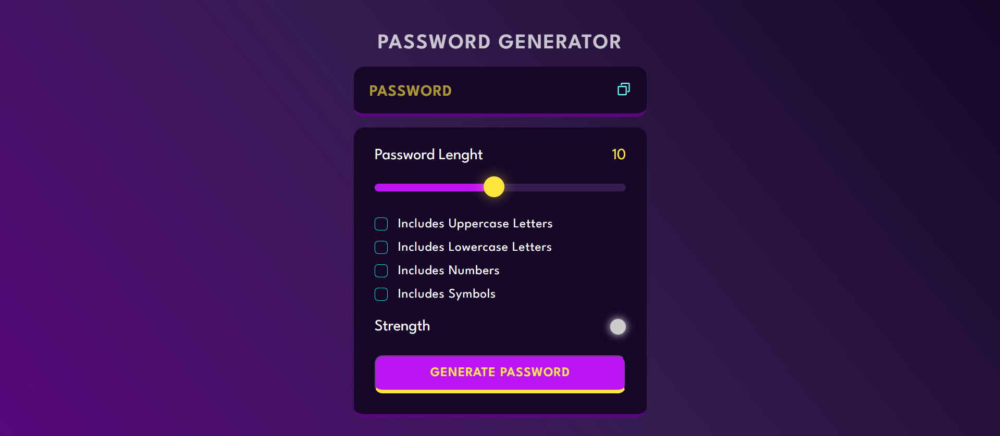

A customizable password generator built with **HTML**, **CSS**, and **JavaScript**. It allows users to create secure passwords with various character options and shows password strength visually.

## 🚀 Features

- ✅ Adjustable password length (slider)
- ✅ Options to include:
  - Uppercase letters
  - Lowercase letters
  - Numbers
  - Symbols
- 🎯 Real-time strength indicator
- 📋 Copy to clipboard functionality
- 🎨 Stylish neon UI with glowing elements

## 🛠 Tech Stack

- HTML5
- CSS3
- JavaScript (ES6)
